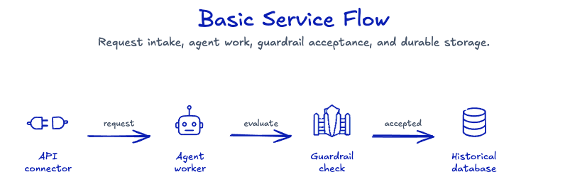
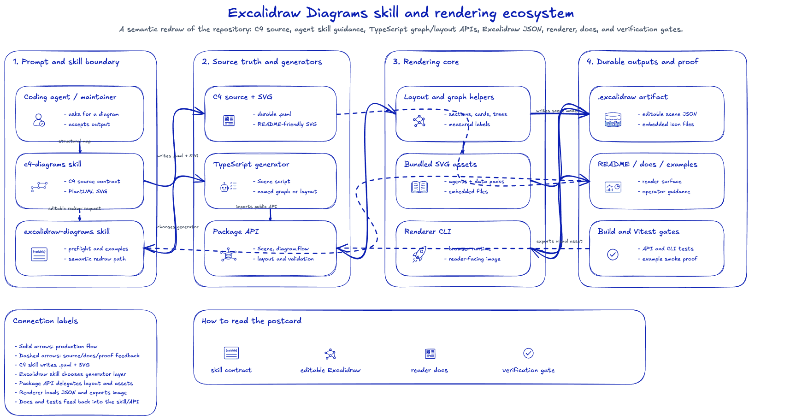
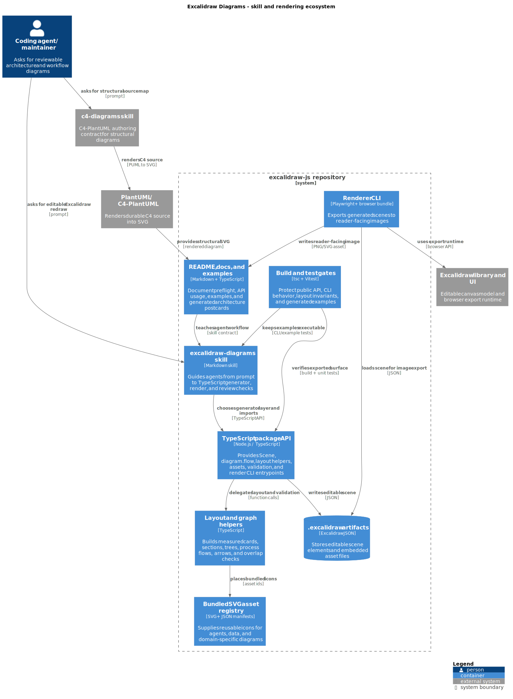

# Excalidraw Diagrams

Agent skill and TypeScript package for drawing reviewable Excalidraw diagrams
from agent prompts, scripts, and small JSON specs.



## Architecture Postcard

This repository can keep both architecture source truth and an editable
Excalidraw redraw. The C4 view is the structural source; the Excalidraw postcard
is the reviewer-friendly map of skills, package APIs, renderer, docs, and proof
gates.



- Editable scene: [excalidraw-js-skill-map.excalidraw](docs/system-design/repo-skill-map/resources/excalidraw-js-skill-map.excalidraw)
- Generator: [generate.ts](docs/system-design/repo-skill-map/generate.ts)
- C4 source: [excalidraw-js-c4.puml](docs/system-design/repo-skill-map/resources/excalidraw-js-c4.puml)



<details>
<summary>PlantUML source</summary>

```plantuml
@startuml
!include https://raw.githubusercontent.com/plantuml-stdlib/C4-PlantUML/master/C4_Container.puml

title Excalidraw Diagrams - skill and rendering ecosystem

Person(agent, "Coding agent / maintainer", "Asks for reviewable architecture and workflow diagrams")

System_Ext(c4skill, "c4-diagrams skill", "C4-PlantUML authoring contract for structural diagrams")
System_Ext(plantuml, "PlantUML / C4-PlantUML", "Renders durable C4 source into SVG")
System_Ext(excalidraw, "Excalidraw library and UI", "Editable canvas model and browser export runtime")

System_Boundary(pkg, "excalidraw-js repository") {
    Container(skill, "excalidraw-diagrams skill", "Markdown skill", "Guides agents from prompt to TypeScript generator, render, and review checks")
    Container(api, "TypeScript package API", "Node.js / TypeScript", "Provides Scene, diagram.flow, layout helpers, assets, validation, and render CLI entrypoints")
    Container(layout, "Layout and graph helpers", "TypeScript", "Builds measured cards, sections, trees, process flows, arrows, and overlap checks")
    Container(assets, "Bundled SVG asset registry", "SVG + JSON manifests", "Supplies reusable icons for agents, data, and domain-specific diagrams")
    ContainerDb(excalidrawFile, ".excalidraw artifacts", "Excalidraw JSON", "Stores editable scene elements and embedded asset files")
    Container(renderer, "Renderer CLI", "Playwright + browser bundle", "Exports generated scenes to reader-facing images")
    Container(docs, "README, docs, and examples", "Markdown + TypeScript", "Document preflight, API usage, examples, and generated architecture postcards")
    Container(tests, "Build and test gates", "tsc + Vitest", "Protect public API, CLI behavior, layout invariants, and generated examples")
}

Rel(agent, c4skill, "asks for structural source map", "prompt")
Rel(c4skill, plantuml, "renders C4 source", "PUML to SVG")
Rel(agent, skill, "asks for editable Excalidraw redraw", "prompt")
Rel(skill, api, "chooses generator layer and imports", "TypeScript API")
Rel(api, layout, "delegates layout and validation", "function calls")
Rel(layout, assets, "places bundled icons", "asset ids")
Rel(api, excalidrawFile, "writes editable scene", "JSON")
Rel(renderer, excalidraw, "uses export runtime", "browser API")
Rel(renderer, excalidrawFile, "loads scene for image export", "JSON")
Rel(renderer, docs, "writes reader-facing image", "PNG/SVG asset")
Rel(docs, skill, "teaches agent workflow", "skill contract")
Rel(tests, api, "verifies exported surface", "build + unit tests")
Rel(tests, skill, "keeps examples executable", "CLI/example tests")
Rel(plantuml, docs, "provides structural SVG", "rendered diagram")

SHOW_LEGEND()
@enduml
```

</details>

## Contents

- [Architecture Postcard](#architecture-postcard): inspect the C4 source and editable Excalidraw redraw of the repository.
- [Install](#install): install the package and bundled agent skill.
- [Ask An Agent](#ask-an-agent): give an agent the right global or project-local preflight.
- [Renderer Dependencies](#renderer-dependencies): prepare Playwright, Chromium, and first PNG render commands.
- [Project Dependency](#project-dependency): install the package in a workspace that writes diagram scripts.
- [More Usage](#more-usage): jump to fuller API, CLI, release, and operator guides.

## Install

Use the one-shot installer on machines where agents should have the CLI,
bundled skill, and PNG renderer available:

```bash
npx -y @kroffske/excalidraw-diagrams install --agent agents --force
```

The installer runs `npm install -g @kroffske/excalidraw-diagrams@latest`,
copies the bundled skill, and prepares the renderer cache. The default user
skill target is:

- `--agent agents`: `~/.agents/skills/excalidraw-diagrams`

Choose another target explicitly when the runner needs it:

```bash
npx -y @kroffske/excalidraw-diagrams install --agent claude --force
npx -y @kroffske/excalidraw-diagrams install --agent codex --force
npx -y @kroffske/excalidraw-diagrams install --project --skip-global --skip-renderer --force
```

Those targets write to:

- `--agent agents`: `~/.agents/skills/excalidraw-diagrams`
- `--agent claude`: `~/.claude/skills/excalidraw-diagrams`
- `--agent codex`: `~/.codex/skills/excalidraw-diagrams`
- `--project`: `./skills/excalidraw-diagrams`

Use `--force` only when replacing an existing skill directory is intended. Use
`--skip-global` when the package is already installed globally, and
`--skip-renderer` when PNG export is not needed on this machine.

If the package is already installed and only the skill needs to be copied, use
the narrower setup command:

```bash
excalidraw-diagrams setup --agent agents
excalidraw-diagrams setup --agent claude
excalidraw-diagrams setup --agent codex
excalidraw-diagrams setup --project
```

## Ask An Agent

After setup, give your coding agent a prompt that starts with the right
preflight for the install mode and then asks for the diagram:

```text
Use the excalidraw-diagrams skill. If this is a global CLI install, first run
`command -v excalidraw-diagrams`, `command -v excalidraw-assets`, and
`command -v excalidraw-render`; if any command is missing, stop and tell me the
exact PATH or install command to fix. If this is a project dependency install,
first resolve `@kroffske/excalidraw-diagrams` from the current workspace and use
`npx --no-install` for package binaries. Do not use absolute paths to package
binaries. Draw a simple service flow with an API request, an agent worker, a
guardrail check, and a database. Save the `.excalidraw` file and render a PNG.
```

The skill guides the agent to create a small script, use bundled SVG assets,
write an `.excalidraw` scene, and render a PNG with `excalidraw-render`.

## Renderer Dependencies

The one-shot installer prepares the renderer unless `--skip-renderer` is used.
The narrower setup command installs only the agent instructions. PNG rendering
uses the package renderer, Playwright, and a local Chromium browser.

For a global CLI install, fail fast by checking that all package binaries are
available through `PATH`:

```bash
command -v excalidraw-diagrams
command -v excalidraw-assets
command -v excalidraw-render
```

If `excalidraw-render` is missing after a global install, add your npm/global
Node bin directory to `PATH` instead of calling the binary through an absolute
path. Use your own npm prefix, for example:

```bash
export PATH="$(npm config get prefix)/bin:$PATH"
```

Install the renderer once on machines where agents should produce PNGs:

```bash
excalidraw-render-setup
```

Use `<path_json>` as a placeholder for your generated `.excalidraw` JSON file.
You can let the render command perform setup before the first render:

```bash
excalidraw-render --setup <path_json> example.png
```

Render with the CLI binary exposed by the package:

```bash
excalidraw-render <path_json> example.png
```

For a project dependency install, first confirm the package resolves from the
current workspace:

```bash
node -e "const {createRequire}=require('node:module'); console.log(createRequire(process.cwd() + '/probe.js').resolve('@kroffske/excalidraw-diagrams'))"
```

Then use `npx --no-install` so npm does not fetch or install anything. On the
first render, include `--setup` so the renderer cache is prepared:

```bash
npx --no-install excalidraw-render --setup <path_json> example.png
```

After the renderer is already installed, the shorter command is enough:

```bash
npx --no-install excalidraw-render <path_json> example.png
```

On Linux, Playwright may require additional browser system libraries. If
Chromium fails to launch with missing dependency errors, install them with:

```bash
sudo npx playwright install-deps
```

If you cannot install system dependencies in the environment, keep the generated
`.excalidraw` JSON file and open it manually in the Excalidraw UI by importing
or dragging the file into <https://excalidraw.com/>.

## Project Dependency

If the agent should generate scripts inside a project, also install the package
there:

```bash
npm install @kroffske/excalidraw-diagrams
```

The main API exports are `Scene`, `AssetRegistry`, `diagram`, and `layout`.

## More Usage

See [docs/usage.md](docs/usage.md) for script examples, CLI commands, bundled
assets, renderer setup, and release checks. See
[docs/operator-guide.md](docs/operator-guide.md) for maintainer and agent
runtime boundaries.
