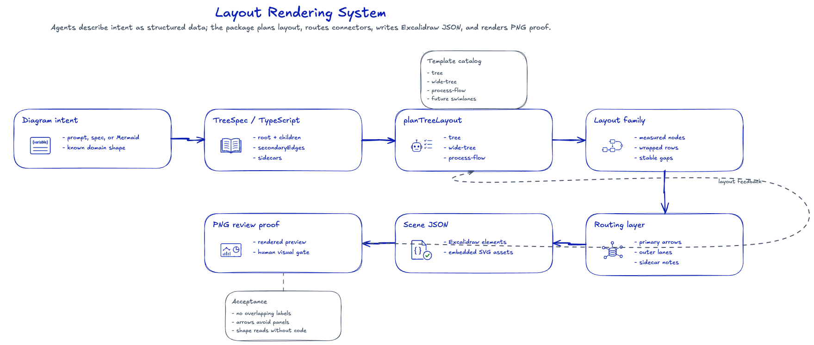
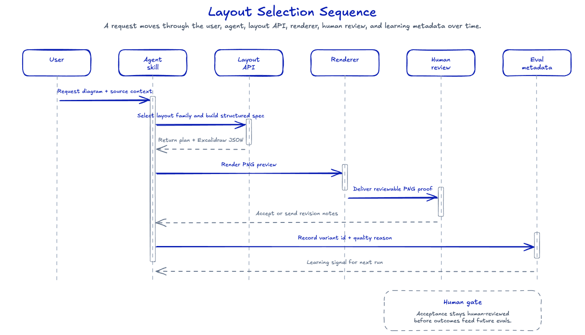

# STD: Layout Rendering And Selection

## Front Panel

`@kroffske/excalidraw-diagrams` must help an agent choose a readable diagram
shape before it writes Excalidraw JSON. The package owns the structured layout
helpers, connector routing, generated `.excalidraw` JSON, and reviewable PNG
proof. The agent skill owns when to choose a layout family, when to ask for
variants, and how to explain the choice to a user.

This document was created after `T-112`, where a document-to-LLM flow was drawn
as a narrow vertical tree even though the content was a long process spine. The
same example also exposed a secondary provenance arrow that routed down around
the whole diagram and visually fought with the primary flow.

## Goals

- Long linear process diagrams should not default to tall narrow trees.
- Deep vertical diagrams should use wider panels when vertical structure is
  truly intentional.
- Secondary, provenance, restore, audit, and feedback edges should use outer
  lanes or sidecar notes instead of crossing the primary trunk.
- The skill should make layout choice explicit before drawing.
- The rendered PNG should be the human acceptance artifact, not just an
  implementation byproduct.

## Non-Goals

- This design does not attempt to become a complete graph layout engine.
- This design does not replace hand-authored diagrams when a maintainer needs
  exact visual control.
- This design does not define the final A/B experiment storage schema; it only
  reserves the sequence path and expected fields.

## System Diagram



Source files:

- `layout-rendering-system.excalidraw`
- `resources/layout-rendering-system.png`
- `generate.ts`

## Sequence Diagram



The sequence diagram keeps a human review point in the loop. A future A/B mode
can generate two candidates, render both previews, collect the user's choice,
and record the variant id, scenario metadata, and short quality reason.

Source files:

- `layout-rendering-sequence.excalidraw`
- `resources/layout-rendering-sequence.png`
- `generate.ts`

## Design

The layout selection layer is deliberately small:

- `layout.planTreeLayout(spec, options, "auto")` inspects node count, depth,
  breadth, and linearity.
- `tree` remains the default for branching or compact hierarchy.
- `wide-tree` widens node panels for deep vertical hierarchy.
- `process-flow` wraps long linear spines into rows so the result is closer to
  a reviewable process diagram than a narrow ladder.
- `routeEdges` keeps cross-level secondary links in outer lanes and avoids
  routing them below the whole diagram by default.
- `sidecars` can attach on `left`, `right`, `top`, or `bottom`, which lets
  process-flow notes sit near their owner without crossing row content.

The data-only CLI exposes the same choice:

```bash
excalidraw-diagrams tree-spec spec.json \
  --layout auto \
  --out diagram.excalidraw \
  --png diagram.png
```

Use `--layout process-flow` when a process spine should be forced into the
wrapped layout. Use `--layout tree` when the hierarchy is intentional.

## Contracts

Tree-spec input remains compatible with the existing shape:

- `root` contains `id`, `title`, `iconId`, optional `bullets`, and optional
  `children`.
- `secondaryEdges` contains `from`, `to`, optional `kind`, optional `label`,
  and optional `lane`.
- `sidecars` contains `id`, `attachTo`, optional `side`, `title`, and optional
  `bullets`.
- `layout` may be `auto`, `tree`, `wide-tree`, or `process-flow`.

The result object now reports the selected layout:

```json
{
  "excalidrawPath": "diagram.excalidraw",
  "elements": 59,
  "files": 7,
  "layout": "process-flow",
  "layoutReason": "linear process with 7 nodes; wrapped process-flow avoids a tall narrow tree"
}
```

## Acceptance

A layout change is accepted only when code checks and visual checks both pass.

Required code checks:

- `npm run typecheck`
- `npm test`
- `git diff --check`

Required visual checks:

- The PNG is not blank.
- Text labels fit inside their intended panels.
- Secondary arrows do not cross title text, panel bodies, or unrelated icons.
- The chosen layout can be understood without opening the generator source.
- Human review accepts the before/after comparison when the task is marked
  `review_required: human`.

## Regeneration

From the repository root:

```bash
npm run build
npx --no-install tsx docs/system-design/layout-rendering/generate.ts
mkdir -p docs/system-design/layout-rendering/resources
node dist/bin/excalidraw-render.js \
  docs/system-design/layout-rendering/layout-rendering-system.excalidraw \
  docs/system-design/layout-rendering/resources/layout-rendering-system.png
node dist/bin/excalidraw-render.js \
  docs/system-design/layout-rendering/layout-rendering-sequence.excalidraw \
  docs/system-design/layout-rendering/resources/layout-rendering-sequence.png
```
