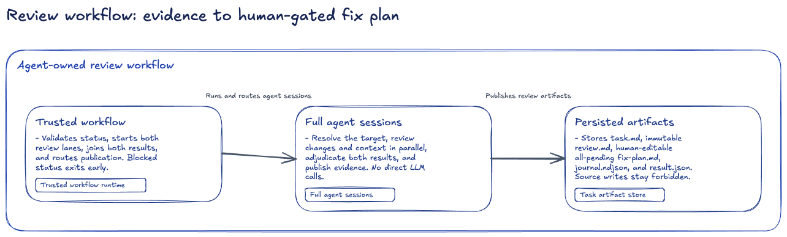
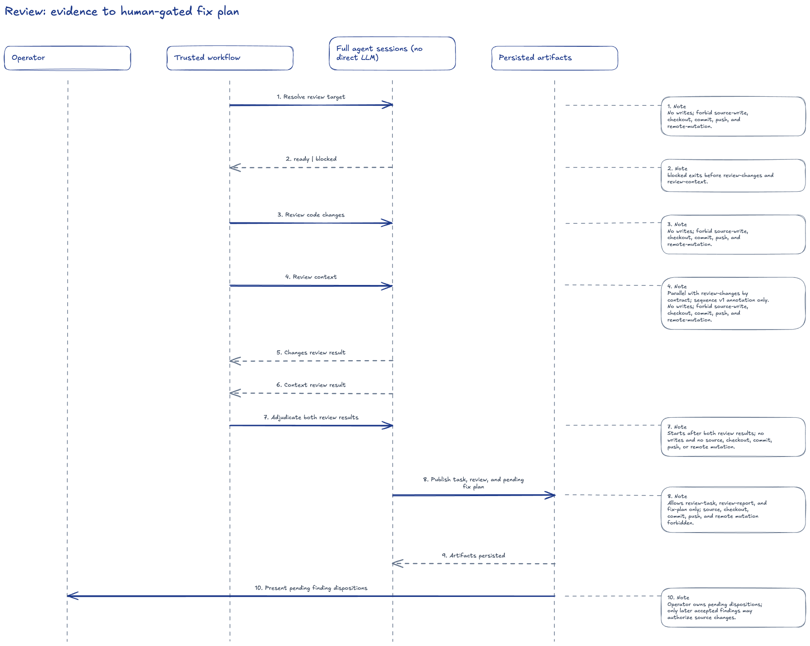
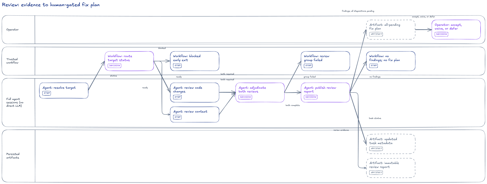
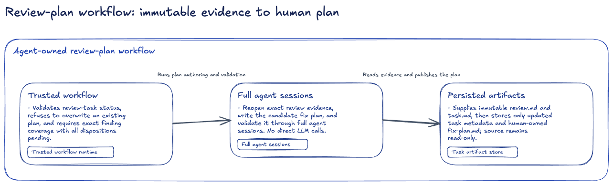
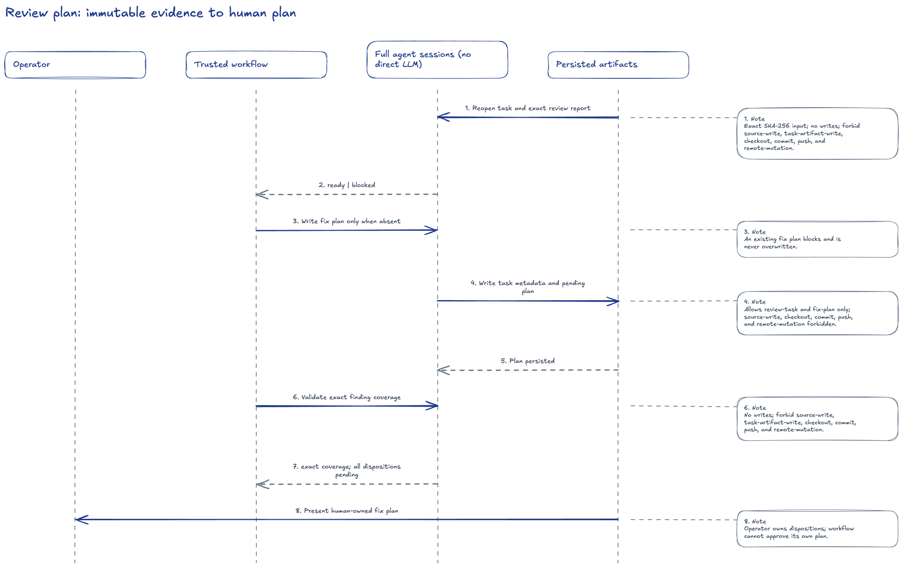
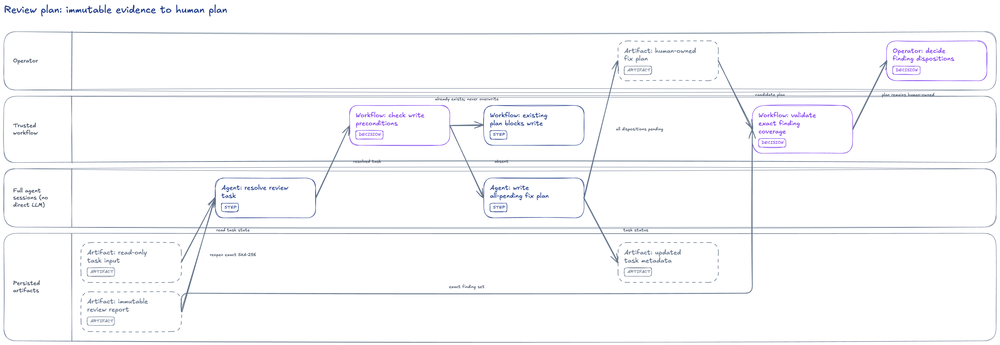
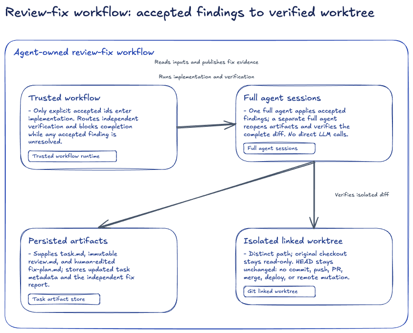
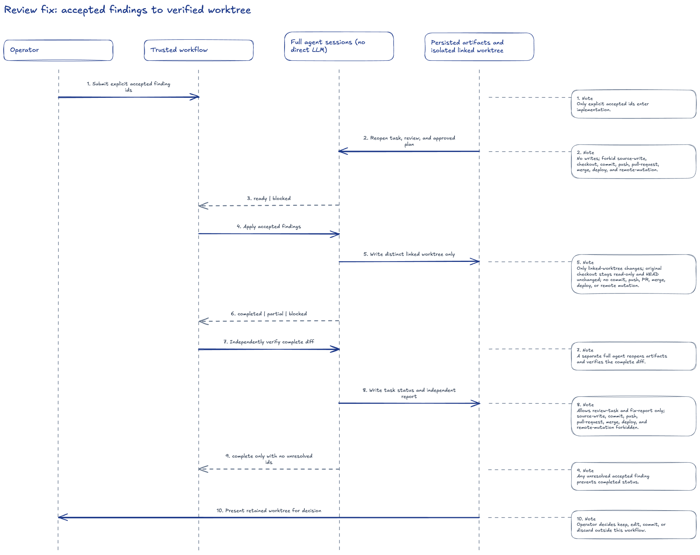
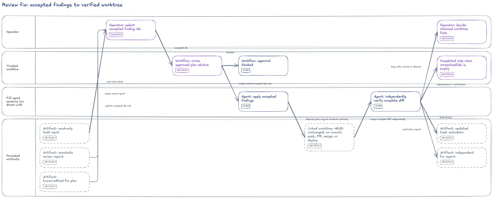

# Agent workflow views

This repository-only gallery compares three independent workflow cases through three questions. The cases are not an execution chain; `crossCaseTransitions` is deliberately empty.

| Case | C4: runtime structure | Sequence: interactions in time | Swimlane: activity ownership |
| --- | --- | --- | --- |
| Review |  |  |  |
| Review plan |  |  |  |
| Review fix |  |  |  |

## View-selection matrix

| View | Use it to answer | Structural strengths | Intended limits |
| --- | --- | --- | --- |
| C4 container | Which internal runtime containers, durable surfaces, responsibilities, and dependencies exist? | Internal container identity and dominant dependency direction. | The operator and human gates are annotation or omission, not false containers. Time and parallelism are outside this view. |
| Sequence interaction | Which cross-participant interactions happen, and in what order? | Participant identity, message endpoints, message kind, and input order. | Concurrency and alternatives are annotation only in the current v1 template. |
| Flow swimlane | Who owns each activity, where can work branch or join, and where do artifacts or humans take over? | Lane membership, activity kind, transition topology, reachability, depth, and fork/join structure. | Runtime-container responsibility is not native swimlane structure. |

All three outputs contain ordinary independently editable Excalidraw elements. Only the swimlane compiler emits native bound connectors that follow moved endpoints; C4 and sequence arrows are intentionally unbound.

## Case findings

- **Review:** C4 makes the trusted workflow, full agent sessions, and task artifacts easy to locate. Sequence makes the four-participant interaction order explicit. Swimlane carries the parallel review branches, their join, and the human disposition handoff structurally.
- **Review plan:** these images are new projections from recovered text. The legacy editable diagram and PNG are unavailable, so this is neither a reconstructed baseline nor evidence of visual equivalence.
- **Review fix:** C4 adds the isolated linked worktree as a fourth internal container. Sequence foregrounds implementation and independent verification interactions. Swimlane makes accepted-only work, completion routing, and retained-worktree ownership visible.

## Ledger-derived information loss

This is a count summary of the evaluated 105-row coverage ledger, not a duplicate ledger. The separate normative expectation map fixes each expected grade and witness. A grade means that the fact is represented structurally, present only in annotation text, or omitted because the view does not own that question.

| View | Structural | Annotated | Omitted |
| --- | ---: | ---: | ---: |
| C4 | 1 | 24 | 10 |
| Sequence | 2 | 33 | 0 |
| Swimlane | 10 | 14 | 11 |

## Connector-label density evidence

Both `review-fix` variants use seed `42`, identical topology, activity order, and card text; only transition `label` fields differ.

| Variant | Labels | Label-label intersections | Label-card intersections | Associated with own route | Traceable to transition |
| --- | ---: | ---: | ---: | ---: | ---: |
| Dense | 12 | 0 | 0 | 11 | 12 |
| Load-bearing | 9 | 0 | 0 | 8 | 9 |

Exact route changes: 0 of 12. Load-bearing labels are the clearer comparison variant because three routine input labels disappear, but neither variant fixes the pre-existing floating label. Evidence only. 'approved-blocked' is 61.74 px from its route in both variants, so this comparison does not establish connector-label acceptance. It changes no package default, routing, placement, or overlap tolerance; T-117 human acceptance remains pending.

- [Dense PNG](label-density/dense/swimlane.png)
- [Load-bearing PNG](label-density/load-bearing/swimlane.png)
- [Machine-readable measurements](label-density/report.json)
- [Hash-bound direct visual review](label-density/visual-review.json)

## Reproduce

```sh
node scripts/generate-agent-workflow-views.mjs
npm run pack:check
```

The generator builds the package, compiles all nine fixtures at seed `42`, normalizes every element `updated` value to zero, renders PNGs with the bundled renderer, and records environment-sensitive PNG hashes separately in `visual-provenance.json`. Normalized scenes and `manifest.json` are semantic determinism evidence; PNG hashes require visual re-review when renderer, browser, or fonts change.

The nested `examples/agent-workflows/` gallery is intentionally absent from the npm package. Evidence is limited to these three frozen workflows; it does not establish lossless conversion, universal workflow coverage, pixel superiority, or a weak-model benchmark.
